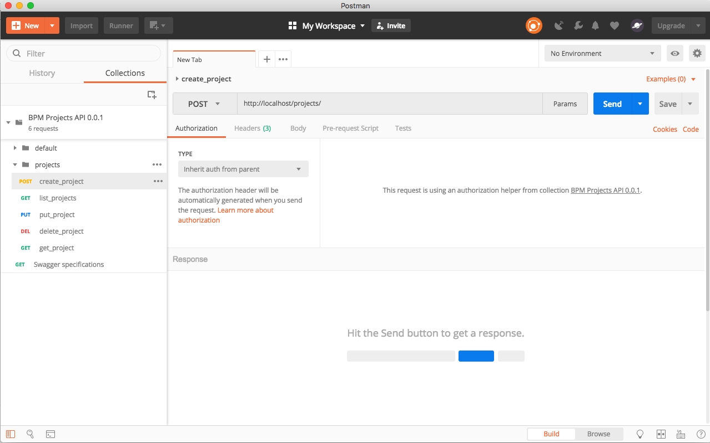

BPM Projects API
================
[](https://travis-ci.com/ioet/bpm-projects-api)
[](https://dev.azure.com/ioet-bpm/bpm-projects-api/_build/latest?definitionId=7)


API for BPM Projects

## Getting started
Follow the following instructions to get the project ready to use ASAP:

### Requirements
Be sure you have installed in your system

- [Python version 3](https://www.python.org/download/releases/3.0/) in your path. It will install
automatically [pip](https://pip.pypa.io/en/stable/) as well.
- A virtual environment, namely [venv](https://docs.python.org/3/library/venv.html).

### Install
Go to the directory of the project
1. Install the virtual environment
    ```bash
    virtualenv env
    source env/bin/activate
    ```
1. Install the dependencies using the `requirements.txt`

   For development
    ```bash
     pip install -r requirements/dev.txt
    ```
   For production
    ```bash
     pip install -r requirements.txt
    ```
    
### Usage

Run the project using 

1. For using Flask's development capabilities as the autoloading set this `FLASK_ENV` environment variable
    to `development`, i.e.
    
    ```bash
    export FLASK_ENV=development
    ```

1. Run the `run` script corresponding to your OS:

    * `source run.sh` for Unix based OS
    * `start run.bat` for Windows
    *  `python -m bpm_projects_api` thanks to the `__main__.py`

What it basically does is to set the `FLASK_APP` env variable to the main package and run the app using `Flask`.
If you are using an IDE like PyCharm the process is way easier because they support configurations for running Flask projects.

1. The main page provides a nice client to test the API and even  for you to provide your JWT: 
   Click the lock.
1. To get a token, go to `/login` and authenticate with any username and password `secret` (Just for now of course).
1. In the main page you will also find a *Models* section for you to check the schema of the managed resources:
   projects and its metadata.
1. The swagger schema can be found in `/swagger.json`. You can even generate client code for this API thanks to
   this file.  

The use of an IDE is highly recommended, namely PyCharm.

#### Notes
Have in consideration that the token will expire each minute.

### Tests

To execute all tests just run

```bash
 python3 -m pytest -v
```
The `-v` shows which tests failed or succeeded.
Have in count that you can also debug each test (`test_*` files) with the help of an IDE like PyCharm.

#### Coverage
To check the coverage of the tests execute

```bash
 coverage run -m pytest -v
```

To get a report table 

```bash
 coverage report
```

To get a full report in html
```bash
 coverage html
```
Then check in the [htmlcov/index.html](./htmlcov/index.html) to see it

### CLI

To show all possible commands to use in the project please execute:

```
 python cli.py
```

#### Generate postman collections
You can generate [Postman][postman_app] collections with the CLI using

```
 python cli.py gen_postman_collection
```
It will print the collection json code to the console. If you want to write the result in a file use the `-f` or
`--filename` option

```
 python cli.py gen_postman_collection -f ~/bpm-projects-collection.json
```

Afterwards you can **import** this collection into [Postman][postman_app] and use it instead of the main web app to 
test this api

<a href="">
  
</a>

## Built with
- [Python version 3](https://www.python.org/download/releases/3.0/) as backend programming language
- [Flask](http://flask.pocoo.org/) as backend framework
- [Flask RestPlus](https://flask-restplus.readthedocs.io/en/stable/) for building Restful APIs
- [Swagger](https://swagger.io/) for documentation and standardization 


## License

Copyright 2018 ioet Inc. All Rights Reserved.

[postman_app]: https://www.getpostman.com/apps